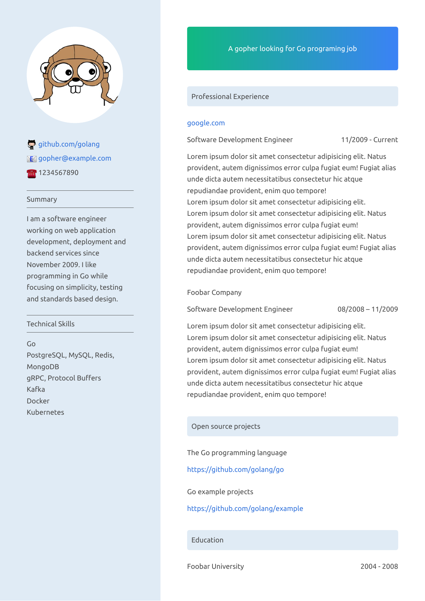

# 2-columns-resume-css

A simple, modern-looking, one page, two columns CSS template for Markdown resume

## Usage

1. Make a copy of example.md and modify it to meet your need

2. Use a Markdown to HTML converter

   There are so many converters written in different languages that it is impossible to list them all. I'm using [yzane.markdown-pdf](https://marketplace.visualstudio.com/items?itemName=yzane.markdown-pdf) because... it can handle this lovely :octocat: emoji out-of-box. If you don't want to use :octocat: emoji you can use [yzhang.markdown-all-in-one](https://marketplace.visualstudio.com/items?itemName=yzhang.markdown-all-in-one) with [bierner.markdown-emoji](https://marketplace.visualstudio.com/items?itemName=bierner.markdown-emoji).

3. Tweak the HTML and CSS files if you need to.

4. Use your browser to print the HTML to PDF file.

   Since this is an one page resume, margins should be set to "none". And don't forget to select "Print backgrounds".

   > [yzane.markdown-pdf](https://marketplace.visualstudio.com/items?itemName=yzane.markdown-pdf) indeed can directly convert Markdown to PDF but there is a bug making CSS layout not working. Meanwhile, browser provides a clearer way to control the options when printing to PDF file.
