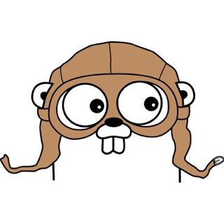

<link rel="stylesheet" href="bulma.min.css" type="text/css">
<link rel="stylesheet" href="2-columns.css" type="text/css">

<aside>

- :octocat: [github.com/golang](https://www.github.com/golang)
- :e-mail: [gopher@example.com](mailto:gopher@example.com)
- :telephone: 1234567890

## Summary

I am a software engineer working on web application development, deployment and backend services since November 2009.
I like programming in Go while focusing on simplicity, testing and standards based design.

## Technical Skills

- Go
- PostgreSQL, MySQL, Redis, MongoDB
- gRPC, Protocol Buffers
- Kafka
- Docker
- Kubernetes

</aside>

<main>

# A gopher looking for Go programing job

## Professional Experience

### [google.com](https://www.google.com)

  

    Software Development Engineer
  

  

    11/2009 - Current
  

- Lorem ipsum dolor sit amet consectetur adipisicing elit. Natus provident, autem dignissimos error culpa fugiat eum! Fugiat alias unde dicta autem necessitatibus consectetur hic atque repudiandae provident, enim quo tempore!

- Lorem ipsum dolor sit amet consectetur adipisicing elit.

- Lorem ipsum dolor sit amet consectetur adipisicing elit. Natus provident, autem dignissimos error culpa fugiat eum!

- Lorem ipsum dolor sit amet consectetur adipisicing elit. Natus provident, autem dignissimos error culpa fugiat eum! Fugiat alias unde dicta autem necessitatibus consectetur hic atque repudiandae provident, enim quo tempore!

### Foobar Company

  

    Software Development Engineer
  

  

    08/2008 – 11/2009
  

- Lorem ipsum dolor sit amet consectetur adipisicing elit.

- Lorem ipsum dolor sit amet consectetur adipisicing elit. Natus provident, autem dignissimos error culpa fugiat eum!

- Lorem ipsum dolor sit amet consectetur adipisicing elit. Natus provident, autem dignissimos error culpa fugiat eum! Fugiat alias unde dicta autem necessitatibus consectetur hic atque repudiandae provident, enim quo tempore!

## Open source projects

### The Go programming language

[https://github.com/golang/go](https://github.com/golang/go)

### Go example projects

[https://github.com/golang/example](https://github.com/golang/example)

## Education

  

    Foobar University
  

  

    2004 - 2008
  

</main>
